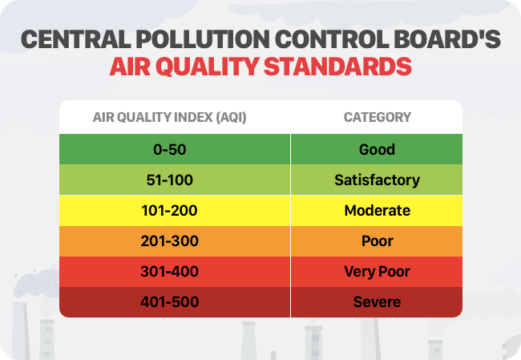

# AIR-QUALITY-INDEX-PREDICTOR

## What is Air Quality Index?

The air quality index (AQI) is an index for reporting air quality on a daily basis. It is a measure of how air pollution affects one's health within a short time period. The purpose of the AQI is to help people know how the local air quality impacts their health.

## How is Air Quality Index measured?

Air quality is measured with the Air Quality Index, or AQI. The AQI works sort of like a thermometer that runs from 0 to 500 degrees. However, instead of showing changes in the temperature, the AQI is a way of showing changes in the amount of pollution in the air.
The **air quality meter PCE-RCM 05** is used to continuously measure the particulate matter content at the workplace. The air quality meter displays **PM2. 5** particulate matter as well as temperature and humidity on the display.

## How Air Quality index is measured in my project :-

Instead of using an expensive instrument to measure the AQI. This project aims to measure the AQI using easily available **climate conditions** values to predict **PM 2.5** value. 
The parameters used to predict AQI in this project are -
- Average Temperature (°C)
- Maximum temperature (°C)
- Minimum temperature (°C)
- Atmospheric pressure at sea level (hPa)
- Average relative humidity (%)
- Average visibility (Km)
- Average wind speed (Km/h)
- Maximum sustained wind speed (Km/h)
 
 All of these parameters are easily available on common weather and climate websites (for eg. - https://en.tutiempo.net/ )
 
 Enter the values of these parameters in projext website ( https://airquality-index-predictor.herokuapp.com/ ) and click on pedict to get Air Quality index.
 
 **ADVANTAGE OF THIS PROJECT IS THAT WE CAN PREDICT THE AIR QUALITY INDEX USING COMMON CLIMATE ATTRIBUTES INSTEAD OF USING AN EXPENSIVE PHYSICAL INSTRUMENT.**
 
## Life cycle of this data science project -

Life cycle of this project can be divided into 3 parts :- 
- Data Collection and Data Cleaning
- Feature Engineering and Model Building
- Deployment of project on web

### Data collection and Data cleaning - 

- For collection of **Independent features** , downloaded HTML pages from https://en.tutiempo.net/ for web scrapping. **(HTML_script.py)**
- For collection of **Dependent featutes**, downloaded csv files of AQI from a 3rd party source(www.weathermap.com) and processed the files to convert them into usuable form. **(PLOT_AQI.py)**
- Performed **web scrapping** on HTML pages to extract Independent features using BeautifulSoup library. Then prepared the final dataset by combining Independent and Dependent features. Then cleaned the data to get rid of null and invalid values. **(Extract_combine.py)**

### Feature Enginnering and Model Building - 

- Performed Feature engineering and data visualization on final dataset. **(LinearRegression.ipynb)**
- Build a Linear Regression Model,trained the model using dataset and used evaluation metrics to check efficiency of model **(LinearRegression.ipynb)**
- Build a Lasso Regression Model,trained the model using dataset and used evaluation metrics to check efficiency of model **(lasso_regression.ipynb)**
- Build a Decision Tree Regression Model,trained the model using dataset and used evaluation metrics to check efficiency of model **(DecisionTreeRegressor.ipynb)**
- Build a Random Forest Regression Model,trained the model using dataset and used evaluation metrics to check efficiency of model **(RandomForestRegressor.ipynb)**
- Build a Xgboost Regression Model,trained the model using dataset and used evaluation metrics to check efficiency of model **(XgboostRegressor.ipynb)**

Maximum accurary was achieved by RandomForestRegressor. Created a pickel file for randomforestregressor model.

### Project Deployment -

refer to the below link -

https://github.com/rohit719/AIR-QUALITY-INDEX-PREDICTOR-DEPLOYMENT

